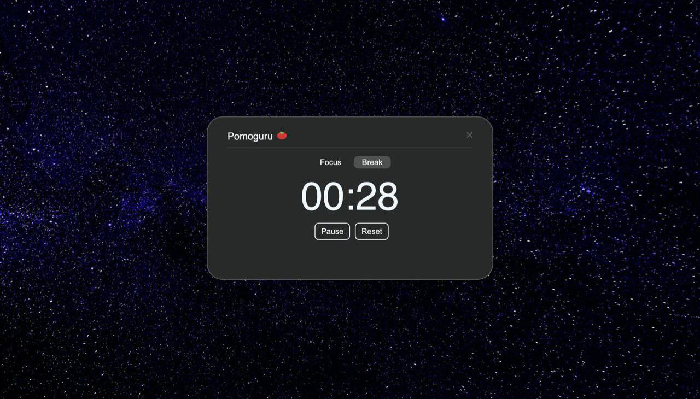

# Pomodoro Timer Web App

## [View-Website](https://25timer.netlify.app/)

## Overview

A simple and intuitive Pomodoro Timer designed to boost productivity by helping users manage their focus and break sessions effectively.

## The Project

## **Installation**

1. Clone the repository: git clone https://github.com/alikssant/pomidoroTimer.git
2. Navigate to the project directory: cd pomodoro-timer
3. Open the app: Simply open the index.html file in your preferred browser.
4. Open [http://localhost:3000](http://localhost:3000) to view it in your browser.

### Features 🚀

- Focus Mode: A 25-minute timer for uninterrupted work sessions.
- Break Mode: A 5-minute timer to recharge during breaks.
- Custom Alerts: Visual "Time is up" message and audio notifications for session transitions.
- User-Friendly Interface: Responsive and easy to use on any device.
- Pause & Reset: Pause or reset the timer anytime with intuitive controls.

## Technologies Used 🧰

 

## How It Works 🔧

1. Start a Session: Click "Start" to begin your focus or break session.
2. Switch Modes:

   - Click Focus to set the timer to 25 minutes.
   - Click Break to set the timer to 5 minutes.

3. Pause or Reset: Use the "Pause" or "Reset" buttons to stop or restart the timer.
4. End of Session: When the timer reaches 0, a notification sound plays, and the screen displays "Time is up."

## Future Enhancements 🔮

- Add customizable session and break durations.
- Include dark mode for better usability in low light.
- Save user preferences using local storage.
- Add daily and weekly productivity tracking.
